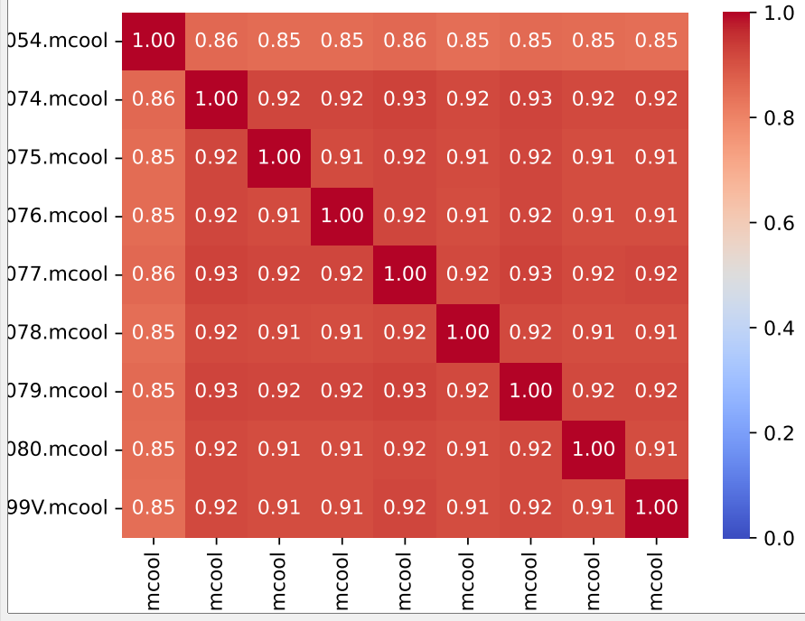

# 计算HiC、ChIA-PET等其它类似的交互数据的样本重复性

软件的详细说明见[HicRep](http://www.bioconductor.org/packages/release/bioc/vignettes/hicrep/inst/doc/hicrep-vigenette.html)，或者一个[自带的步骤](https://rdrr.io/bioc/hicrep/man/hicrep-package.html)<br/>
该软件适配的是计算某一条染色体上的重复性，不是整个基因组，我们可以将整个基因组看作是一条染色体来计算。<br/>

### 需要准备的软件和文件
- python
- R
- bedtools

$ `python cal.py -p input.bedpe -g input.size -b 1000000 -o output -c 1 -a 0` <br/>
-c 是是否将a[i][j]和a[j][i]这样的加起来。默认是0，不合并。对于HiC、ChIA-PET类似的数据，-c 1，得到是对称阵。当遇到Grid-Seq这种DNA-RNA交互的时候，请将1-3列固定为DNA(RNA)，将4-6列固定为RNA(DNA)，然后-c 0就可以得到最终的交互结果，此时得到的是不对称阵<br/>
-a 是否计算染色体间的交互。默认是1计算整个基因组的交互，包括染色体间的。0是舍弃所有染色体间的交互。<br/>
在该案例中，计算的是染色体内部的交互<br/>
$ `awk -v OFS="\t" '{print "chr1",(NR-1)*1000000,NR*1000000,$0}' output.mat > output.final.mat`<br/>
这样所有的准备工作就做好了。

$ `Rscript runR.r example/test1_Rep1.final.mat example/test1_Rep2.final.mat example/test2_Rep1.final.mat example/test2_Rep2.final.mat`
就可以得到最终结果，[result.out.txt](example/result.out.txt)和[result.out.heatmap.pdf](example/result.out.heatmap.pdf)<br/>


### 注意事项
1：当看到输出的smooth超过10的时候请将runR.r的增加<br/>
2：当最终输出的相关性有小于0.8的时候，请修改 bk<br/>
3：每次平滑过程不一定相同，最终计算出来的相关性不一定一样<br/>


# [另一种做法](https://github.com/dejunlin/hicrep)
```
pip install hicrep

hicConvertFormat -m TEST.hic -o TEST.mcool --inputFormat hic --outputFormat cool

cat /data/home/ruanlab/huangxingyu/Haoxi20230315/20230205_pipeline/refs/hg38/bwa/hg38.fa.fai | grep -v -e chrM -e chrY | sed 's/chr//g' > hg38.hic.size
cat /data/home/ruanlab/huangxingyu/Haoxi20230315/20230205_pipeline/refs/mm10/bwa/mm10.fa.fai | grep -v -e chrM -e chrY | sed 's/chr//g' > mm10.hic.size

python hicrep.auto.py  -i TEST1.mcool,TEST2.mcool,TEST3.mcool,TEST4.mcool,TEST5.mcool -o hg38.hic.cor -s hg38.hic.size
```
